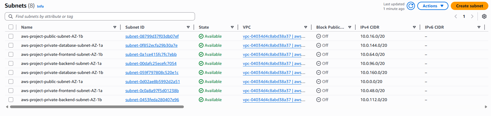
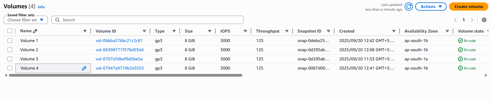

# Production Grade 3-Tier Architecture on AWS

This project demonstrates the implementation of a production-grade three-tier architecture on Amazon Web Services (AWS). The architecture is designed to be highly available, scalable, and secure, following AWS best practices.

## Architecture Diagram

## Components

### VPC and Networking

- **VPC Configuration**
  
- **Subnets**
  
  

- **Internet Gateway**
  

- **NAT Gateway**
  

- **Route Tables**
  

### Computing Layer

- **EC2 Instances**
  

- **Launch Template**
  

- **Auto Scaling Group**
  

- **AMI Images**
  

### Load Balancing

- **Application Load Balancer**
  

- **Target Groups**
  

### Database Layer

- **RDS Instance**
  

- **RDS Subnet Group**
  

### Security

- **Security Groups**
  

### Monitoring and Storage

- **CloudWatch Monitoring**
  

- **EBS Volumes**
  

## Key Features

- Highly available architecture across multiple Availability Zones
- Auto-scaling capabilities for handling varying loads
- Secure network design with public and private subnets
- Managed database service with Amazon RDS
- Comprehensive monitoring with CloudWatch
- Load balancing for optimal traffic distribution

## Security Considerations

- Private subnets for application and database layers
- NAT Gateway for secure outbound internet access
- Security groups for fine-grained access control
- Network ACLs for additional security layer

## Best Practices Implemented

1. High Availability across multiple AZs
2. Auto-scaling for handling variable workloads
3. Proper network segmentation
4. Secure database configuration
5. Regular monitoring and alerting
6. Backup and disaster recovery setup

## Infrastructure Management

- Infrastructure as Code (IaC) principles followed
- Regular backups and snapshots configured
- Monitoring and alerting in place
- Auto-scaling policies based on demand
